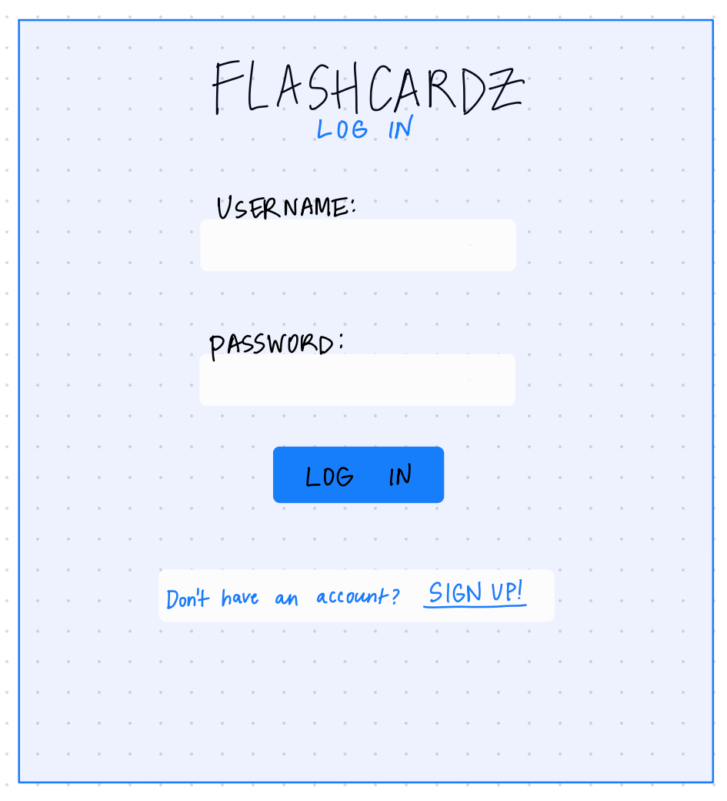
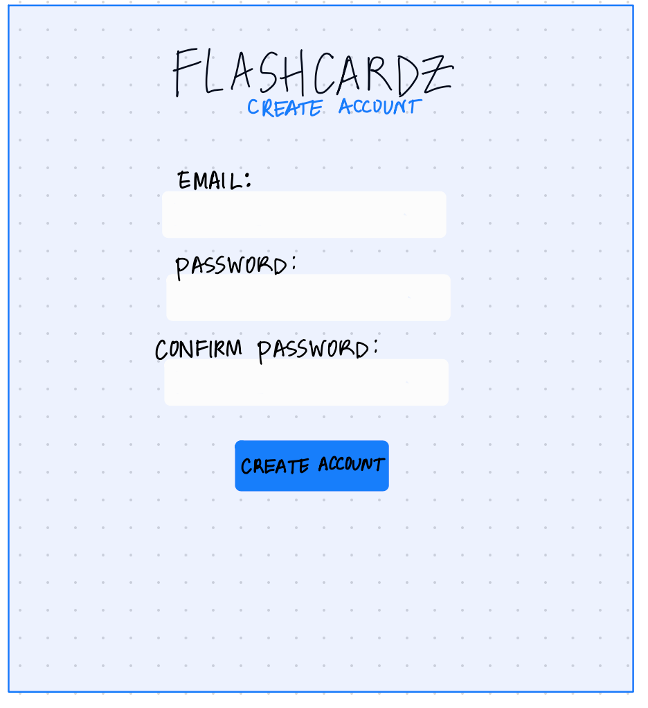
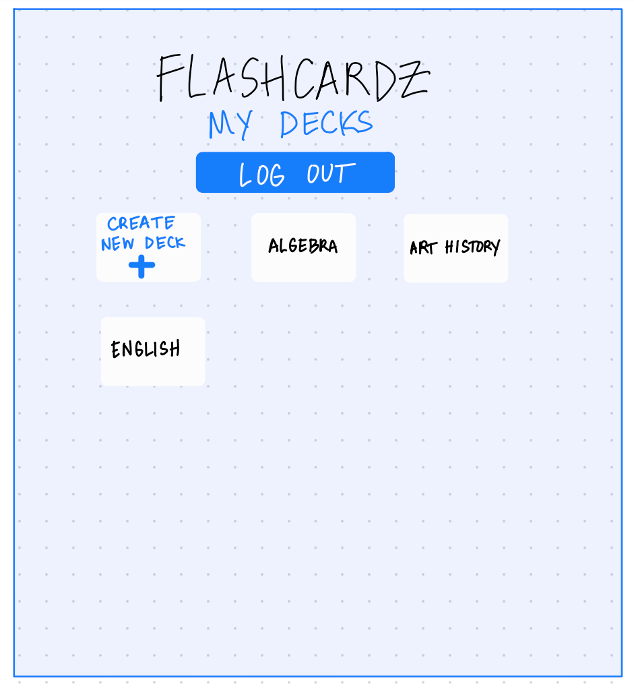
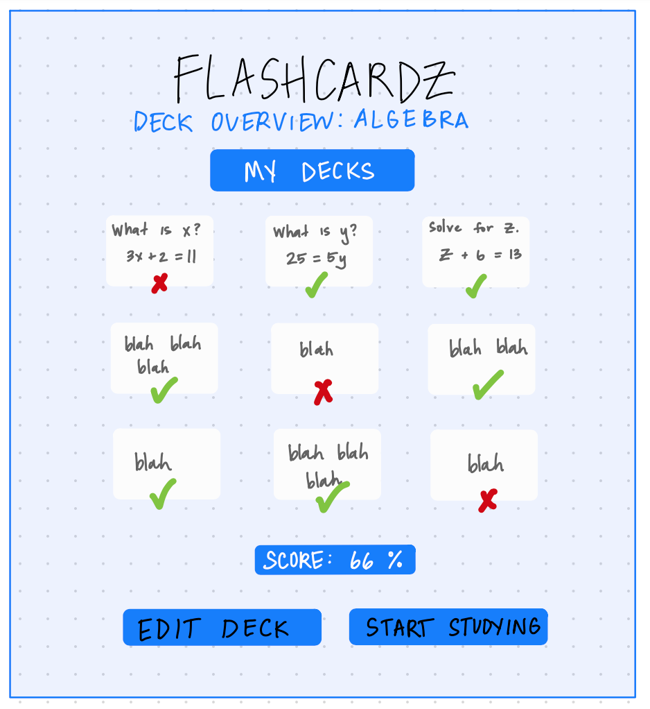
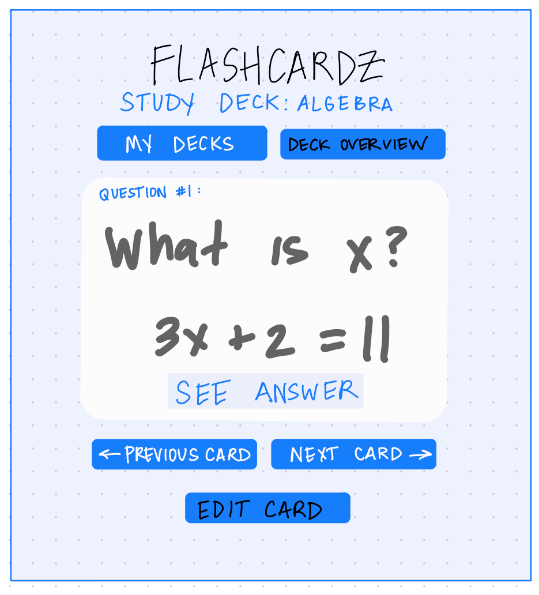
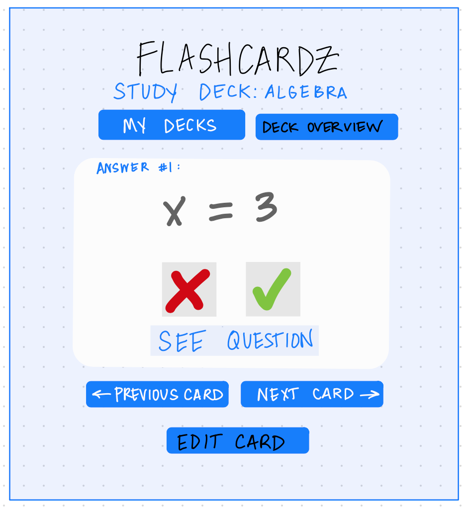
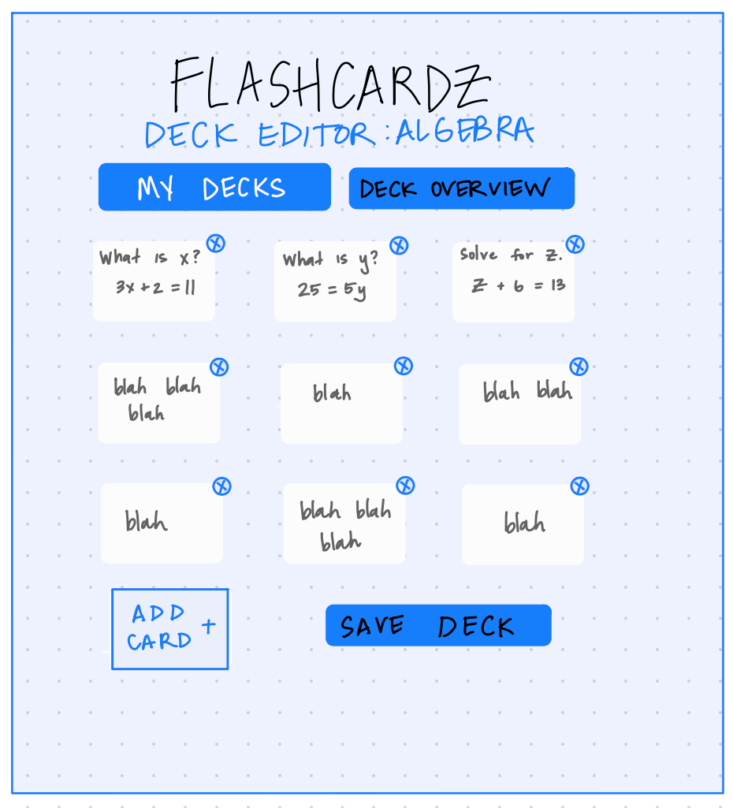
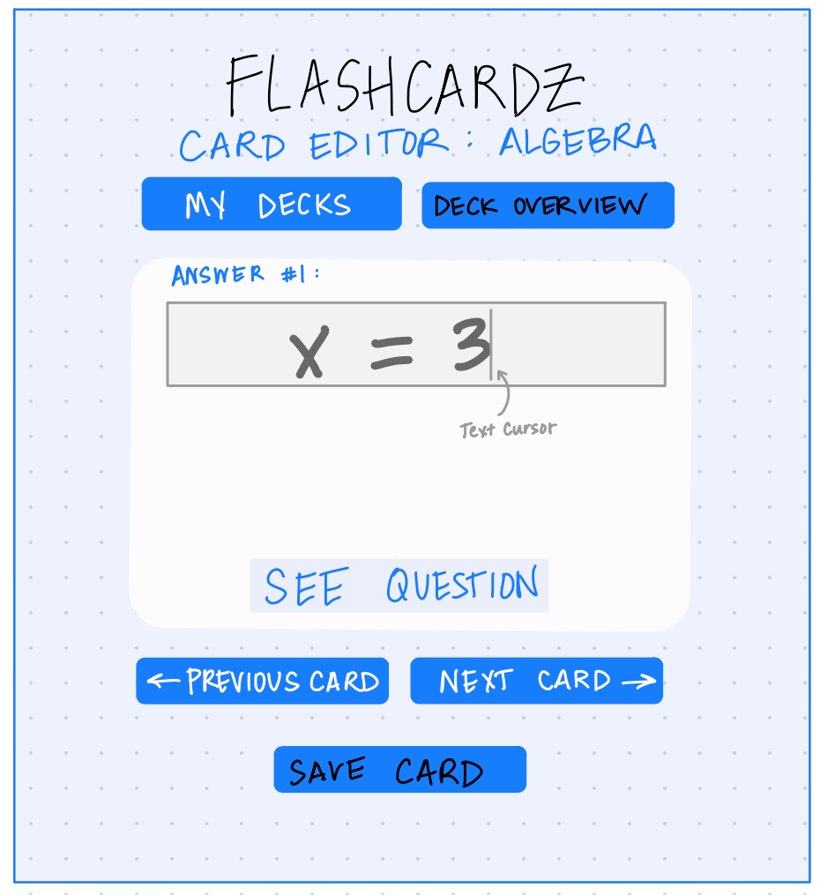

# Milestone 4 Outline

### Page Template:
* Page Title - **Margarita**
* Page Description (include a mockup or hand drawn image of the page) - **Margarita**
* Parameters needed for the page - **Derek**
* Data needed to render the page - **Derek**
* Link destinations for the page - **Jonathan**
* List of tests for verifying the rendering of the page - **Jessica**

---

## Title: Login page
- **Description:** This page is the homepage for our project, this is where a user can log in to our site. 
- **Parameters:** none
- **Data:** GET: none | POST: user email, password
- **Link Destinations:** Create_Account (if they don't currently have an account) and My_Decks (once they login successfully)
- **Tests:**

1. Does the page title "Log In" properly render?
2. Does the css formatting properly render?
3. Does the page title "Login" show up?
4. Does the login functionality recognize a past user's credentials?
5. If a new user tries to enter credentials, does the webpage ask the user to create an account?
6. If it is a new user, does the "create an account button" bring you to the "Create an account" page?
7. When you click the "login button," does it bring you to the "My Decks" page?
8. Are the username's constraints that the username is not null and unique working properly?
9. Are the password's constraint that it is not null working properly?

**Mockup:** 

---

## Title: Create an account
- **Description:** This page is where a user can create an account to our site. 
- **Parameters:** none 
- **Data:** GET: none | POST: user email, password
- **Link Destinations:** Homepage_Login
- **Tests:**

1. Does the page title "Create an account" properly render?
2. Does the css formatting properly render?
3. If a user enters their information into the "Create an account" screen, does it save the data in the database?
4. After the user is done providing the account information, when they click "Submit," does it bring them to the "Login" page?
5. If a user who is already in the database tries to create another account, does it provide a warning message to the user that they cannot create a second account? Is the database constraint properly executed to prevent a duplicate account?
6. Does the database store the hashed password?

**Mockup:** 

---

## Title: My Decks
- **Description:** This page is a homepage for users once they are logged into their account, this page will list out all of the decks the user has created.
- **Parameters:** user_id `/mydecks?userid=<user_id>`
- **Data:** GET: user decks (name), email, user id 
- **Link Destinations:** Deck_Overview | Homepage_Login (upon logout)
- **Tests:**

1. Does the page title "My Decks" properly render?
2. Does the css formatting properly render?
3. If the user has not created any Decks, they should not see any Decks.
4. If the user has created 1 Deck, that deck should be listed. 
5. If the user has created 2 Decks, both decks should be listed.
6. Does selecting a deck bring the user to "Deck Overview" page for the correct Deck? 
7. When you click "log-out," are you actually logged-out?

**Mockup:** 

---

## Title: Deck Overview
- **Description:** This page is an overview of a specific deck. The user will see a thumbnail view of each card, view "correct"/"incorrect" score of each card, and the option to click "Start Studying".
- **Parameters:** deck_id, user_id `/deck/overview?deckid=<deck_id>&userid=<user_id>`
- **Data:** GET: deck name, card count, all associated cards (front_text), all associated card scores for current user
- **Link Destinations:** My_Decks | Study_Deck | Deck_Editor | Homepage_Login (upon logout)
- **Tests:**

1. Does the page title "Deck Overview" properly render?
2. Does the css formatting properly render?
3. If the user has created a Deck, do the card images render? Is the correct text displayed for the front of the card? Are there the correct number of cards?
4. Does the deck overview properly display "correct/incorrect" score of each card?
5. Does the deck total "score" properly display?
6. Is there a button to to "Start Studying?"

**Mockup:** 

---

## Title: Study Deck
- **Description:** This page is a single card view within a deck that will include the option to view the next card, previous card, or deck overview. The user will also be able to score individual cards as "correct" or "incorrect".
- **Parameters:** deck_id, user_id, card_id `/deck/study?deckid=<deck_id>&userid=<user_id>&cardid=<card_id>`
- **Data:** GET: deck name, all associated cards (front_text & back_text), current card_id | PUT: correct/incorrect for card id tested, user id
- **Link Destinations:** Deck_Overview | Card_Editor | Homepage_Login (upon logout)
- **Tests:**

1. Does the page title "Study Deck" properly render?
2. Does the css formatting properly render?
3. Is the proper data for the front and backs of the cards displayed?
4. Does the "next card" button bring you to the next card?
5. Does the "previous card" button bring you to the previous card?
6. Does the button to score individual cards as correct function properly?
7. Does the button to score individual cards as incorect function properly?
8.  Does the user's score reflect the number of correct answers as a percentage of all cards in the deck?

**Mockup:** 

 

---

## Title: Deck Editor
- **Description:** This page will allow the user to create or edit a deck by adding or removing cards. 
- **Parameters:** deck_id, user_id `/deck/edit?deckid=<deck_id>&userid=<user_id>`
- **Data:** GET: deck name, card count, all associated cards (front_text & back_text) | PUT: new deck name | DELETE: deck_id, user_id
- **Link Destinations:** Deck_Overview | Homepage_Login (upon logout)
- **Tests:**

1. Does the page title "Deck Editor" properly render?
2. Does the css formatting properly render?
3. If a user adds a new card, does it show up in the View/Study Deck page?
4. If a user removes a card, does it disappear from the View/Study Deck page?

**Mockup:** 

---

## Title: Card Editor
- **Description:** This page will allow the user to edit a single card within a deck by editing the "Question" or "Answer" portion of the card.
- **Parameters:** card_id, user_id `/card?cardid=<deck_id>&userid=<user_id>`
- **Data:** GET: front_text, back_text | PUT: new front_text, back_text, card_id, user_id | DELETE: card_id, user_id
- **Link Destinations:** Deck_Editor | Homepage_Login (upon logout)
- **Tests:**

1. Does the page title "Card Editor" properly render?
2. Does the css formatting properly render?
3. If the user edits a Question, does the new question and old Answer appear?
4. If the user edits an Answer, does the old question and new Answer appear?
5. If the user edits an Answer and Questions, do both the new question and new answer appear?

**Mockup:** 

---
